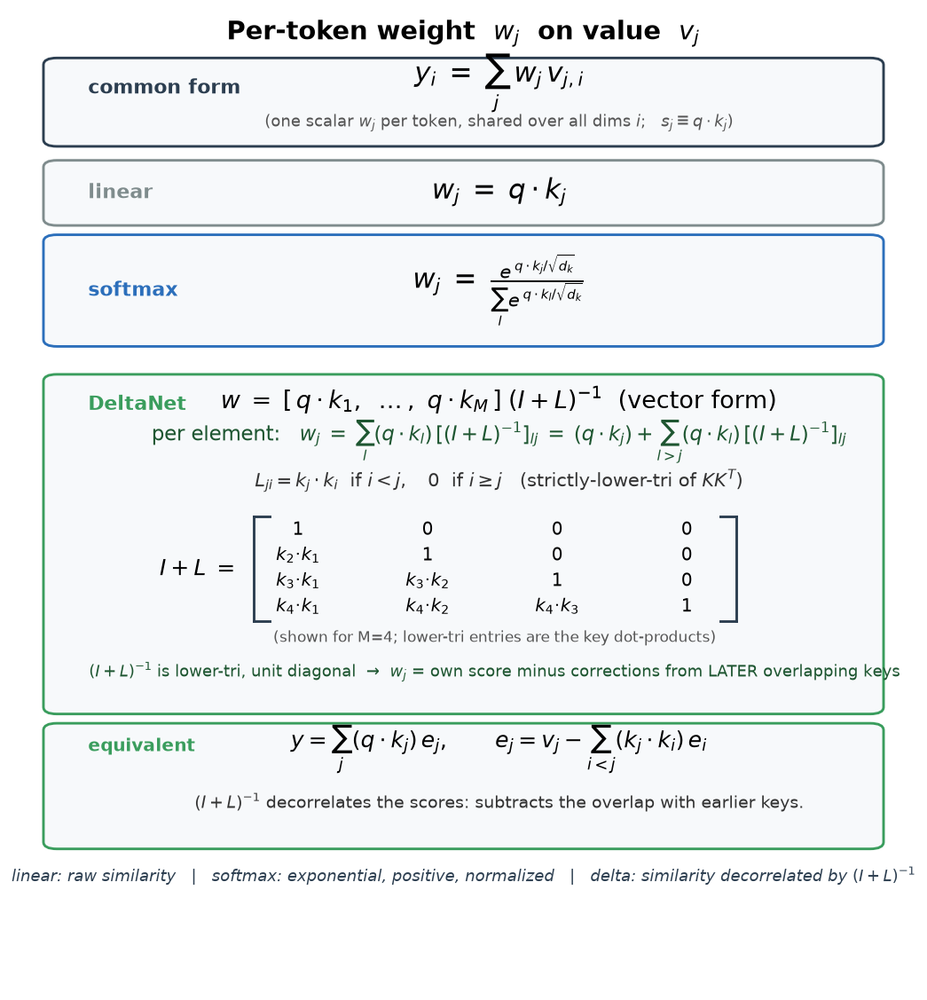
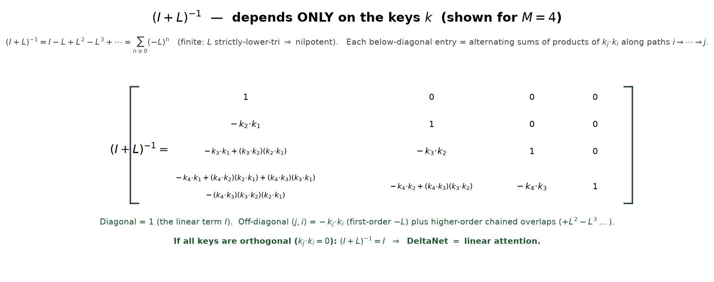
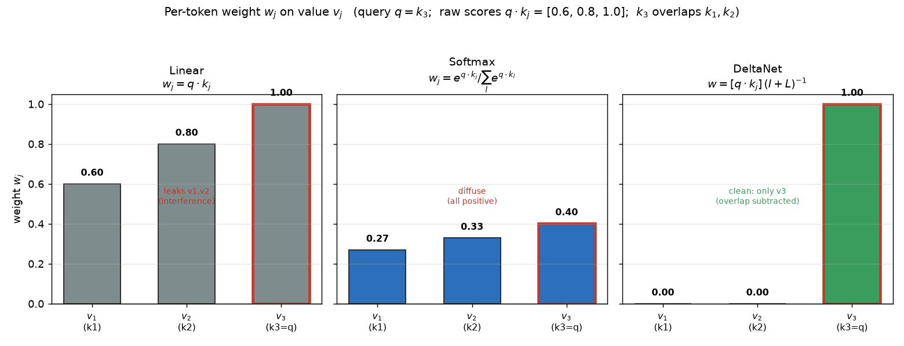

# Per-token weight formulas: linear vs softmax vs DeltaNet




For a query `q` and `M` stored tokens with keys `k₁…k_M` and values `v₁…v_M`, all three
mechanisms produce the output as a **weighted sum of the values**, with one scalar weight
`wⱼ` per token (the **same weight for every value dimension** `i`):

```
yᵢ = Σⱼ wⱼ · vⱼ,ᵢ        (i = feature index;  wⱼ shared across all i)
```

Let `sⱼ = q · kⱼ` be the raw query–key similarity. The three cases differ only in `wⱼ`.

---

## 1. Linear attention

```
wⱼ = q · kⱼ = sⱼ
```
Raw similarity, used directly. (May include a scale `1/√d_k`, but no nonlinearity.)

---

## 2. Softmax attention

```
              exp( q · kⱼ / √d_k )              exp( sⱼ / √d_k )
wⱼ = ────────────────────────────────  =  ──────────────────────
        Σₗ₌₁ᴹ  exp( q · kₗ / √d_k )          Σₗ  exp( sₗ / √d_k )
```
Exponential of the similarity, normalized over all `M` keys. Always `wⱼ > 0`, `Σⱼ wⱼ = 1`.

---

## 3. DeltaNet (delta rule, write-strength β = 1)

Let `s = [ q·k₁ , q·k₂ , … , q·k_M ]` (row vector of similarities). Then

```
vector form:   w = s · (I + L)⁻¹
per element:   wⱼ = Σₗ (q·kₗ) · [(I+L)⁻¹]ₗⱼ  =  (q·kⱼ) + Σ_{l>j} (q·kₗ)·[(I+L)⁻¹]ₗⱼ
```
(Unlike linear/softmax, DeltaNet's `wⱼ` is a linear combination of **all** the scores, so it
is naturally a vector `w`; the per-element form above is the scalar version. Because `(I+L)⁻¹`
is lower-triangular with unit diagonal, `wⱼ` = token j's own score **minus** corrections from
*later* overlapping keys — the decorrelation.)

where `L` is the **strictly-lower-triangular part of the key Gram matrix `K Kᵀ`**:

```
Lⱼᵢ = kⱼ · kᵢ    if  i < j        (each key vs the EARLIER keys — causal)
Lⱼᵢ = 0          if  i ≥ j
```

Written out (`M × M`):

```
          i=1        i=2        i=3      ⋯   i=M
      ┌                                              ┐
 j=1  │  0          0          0        ⋯    0       │
 j=2  │  k₂·k₁      0          0        ⋯    0       │
 L =  │  k₃·k₁      k₃·k₂      0        ⋯    0       │
 j=3  │  ⋮                                           │
 j=M  │  k_M·k₁     k_M·k₂     k_M·k₃   ⋯    0       │
      └                                              ┘

              ┌                                              ┐
              │  1          0          0        ⋯    0       │
              │  k₂·k₁      1          0        ⋯    0       │
   I + L  =   │  k₃·k₁      k₃·k₂      1        ⋯    0       │
              │  ⋮                                           │
              │  k_M·k₁     k_M·k₂     k_M·k₃   ⋯    1       │
              └                                              ┘
```

Its **inverse** `(I+L)⁻¹` (which is what actually multiplies the scores) depends only on the
keys, and equals the finite series `I − L + L² − L³ + ⋯` (finite because `L` is nilpotent).
Written out (M=4):

```
                ┌                                                                  ┐
                │  1                                              0       0     0  │
                │  −(k₂·k₁)                                       1       0     0  │
(I+L)⁻¹ =       │  −(k₃·k₁)+(k₃·k₂)(k₂·k₁)                        −(k₃·k₂) 1     0  │
                │  −(k₄·k₁)+(k₄·k₂)(k₂·k₁)+(k₄·k₃)(k₃·k₁)                            │
                │        −(k₄·k₃)(k₃·k₂)(k₂·k₁)                   −(k₄·k₂)         │
                │                                                +(k₄·k₃)(k₃·k₂)  −(k₄·k₃) 1  │
                └                                                                  ┘
```

Diagonal = 1 (the linear `I` term); each below-diagonal `(j,i)` entry = `−(kⱼ·kᵢ)` (first-order
`−L`) plus higher-order chained-overlap products (`+L² − L³ …`). If all keys are orthogonal
(`kⱼ·kᵢ = 0`), `(I+L)⁻¹ = I` and DeltaNet = linear attention. See figure:


So the DeltaNet weight is the raw similarity vector **decorrelated** by the inverse of the
causal key-overlap matrix `(I + L)`. The `(I+L)⁻¹` factor subtracts the components of `q`'s
similarity that are already explained by *earlier* overlapping keys — the causal,
incremental form of the pseudoinverse "whitening" `K⁺`.

Equivalent recurrence form (same `w`, no matrix inverse): the readout is
`y = Σⱼ (q·kⱼ) · eⱼ` with the errors defined causally by
```
eⱼ = vⱼ − Σ_{i<j} (kⱼ·kᵢ) · eᵢ
```

---

## Summary

```
linear :  wⱼ = q·kⱼ
softmax:  wⱼ = exp(q·kⱼ /√d_k) / Σₗ exp(q·kₗ /√d_k)
delta  :  w  = [q·k₁ … q·k_M] · (I + L)⁻¹ ,   Lⱼᵢ = (kⱼ·kᵢ if i<j else 0)
```

Generalizations (not shown above): a per-token write-strength `βⱼ` scales row `j` of the
delta update, and the Gated-DeltaNet forget gate `αⱼ ∈ (0,1)` multiplies the running state
each step (recency decay). Both keep the "weighted sum of values" form; they only reshape
the `wⱼ`.

Visual (bar chart of `wⱼ` for all three on a 3-key example where `k₃` overlaps `k₁,k₂`):
 — linear leaks `v₁,v₂`; softmax is
diffuse (all positive); delta subtracts the overlap → clean `[0,0,1]`.
