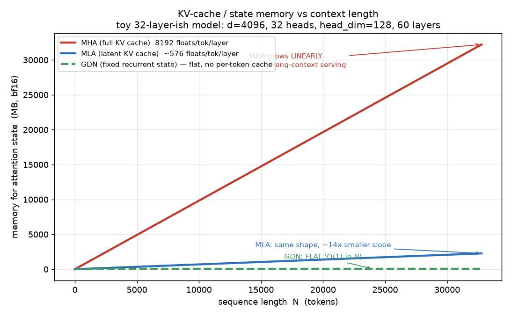
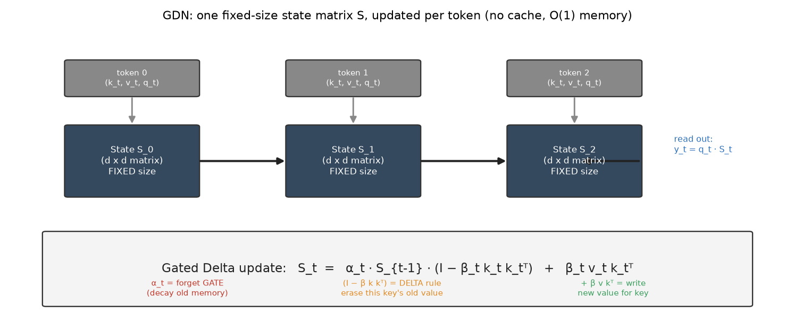
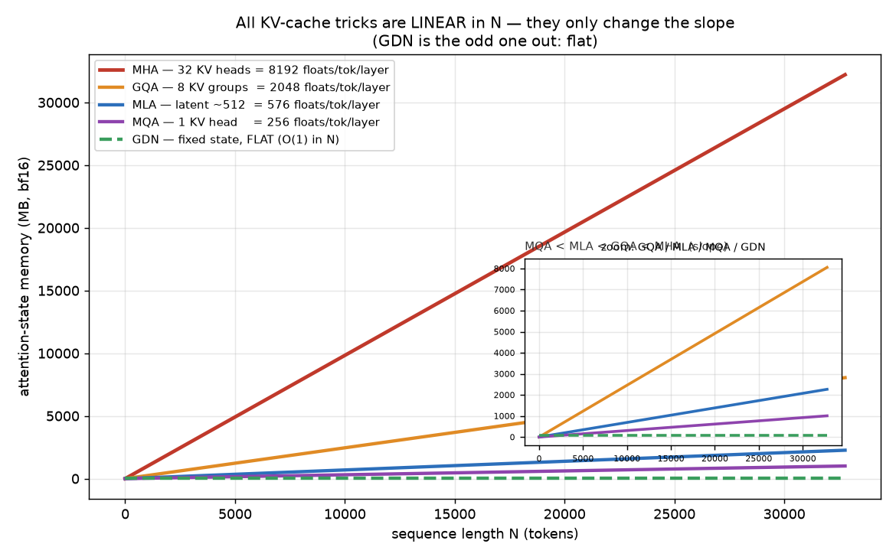
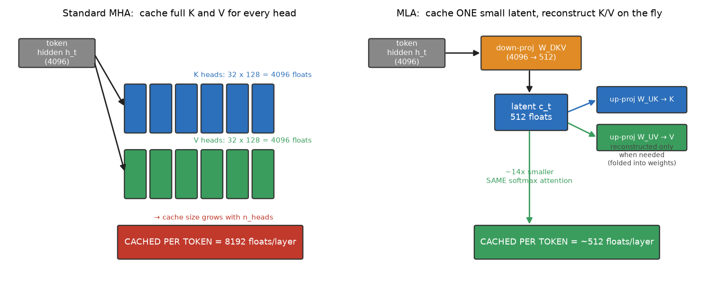
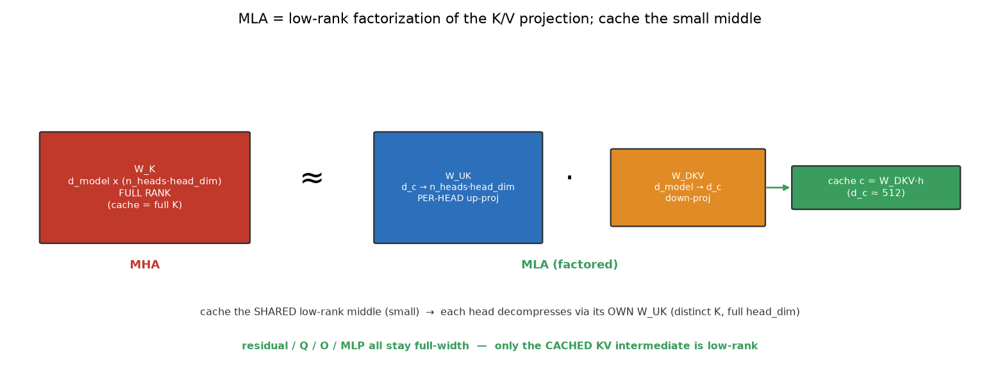
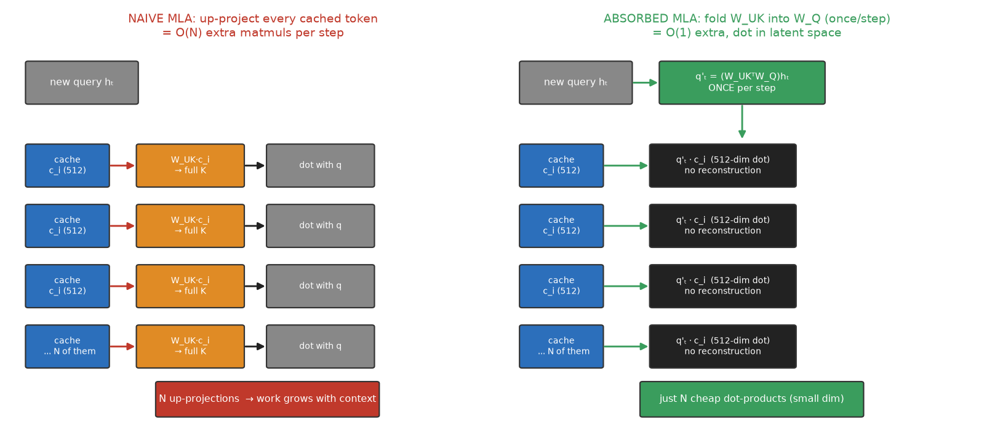
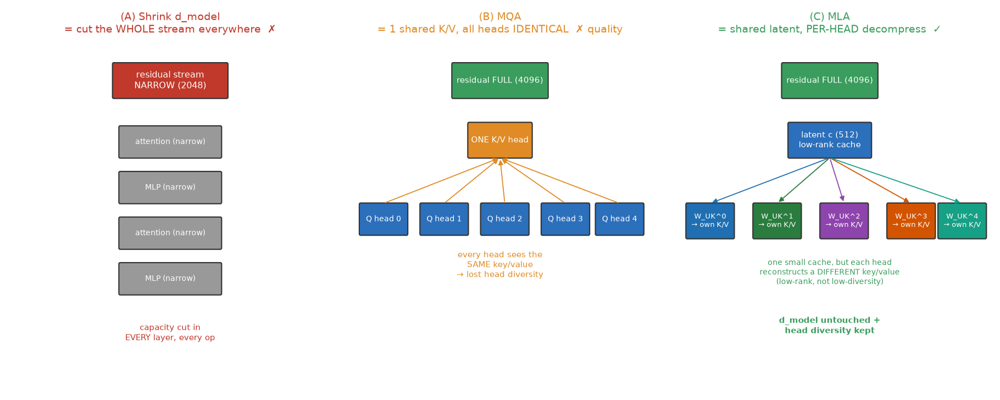
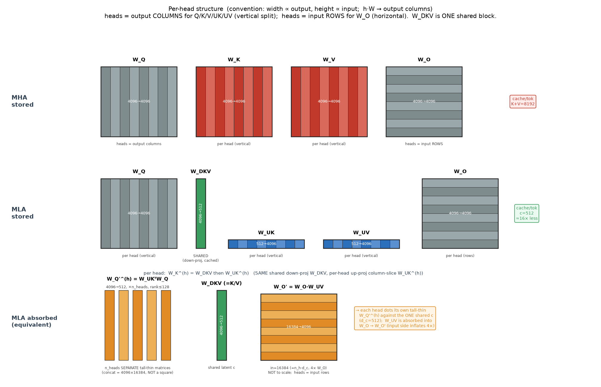
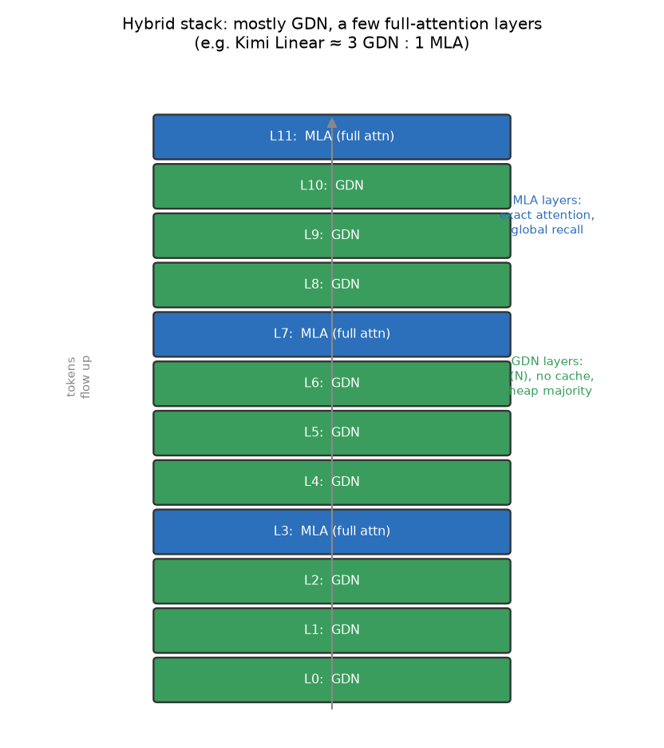
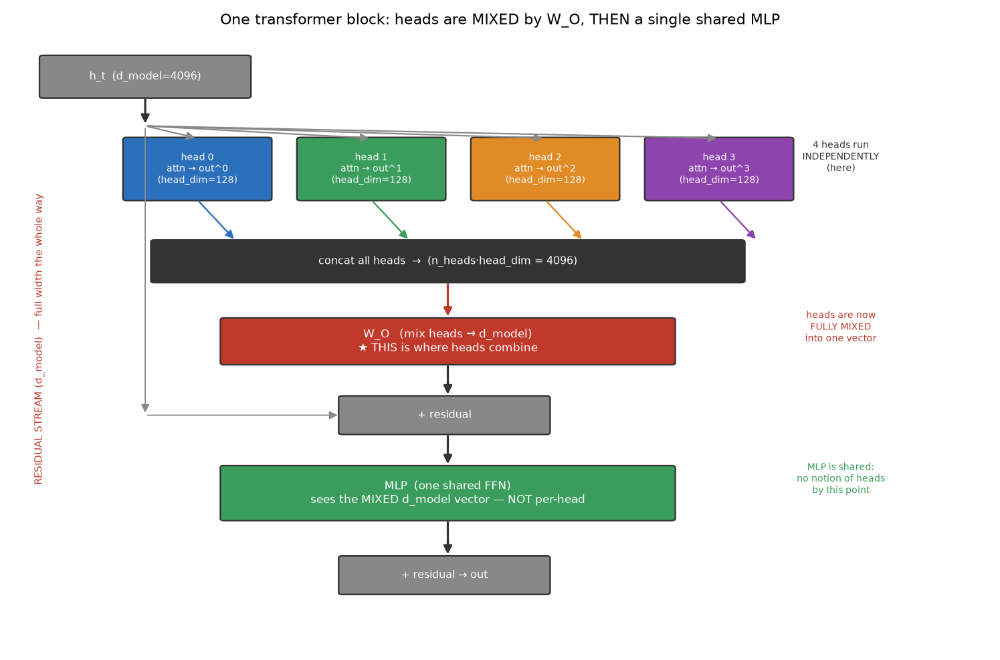

# Attention Efficiency: GDN, MLA, MHA/GQA/MQA — Notes

Built from first principles in a Q&A session. Covers what GDN and MLA are, how the
whole family of KV-cache optimizations relate, the MLA absorption/low-rank trick,
why MLA keeps quality, how heads plug into the block, and why multi-head beats
single-head. Figures live in `../h100_setup/`.

---

## 0. The problem all of this solves

Standard multi-head attention (MHA) has two costs that hurt long context + serving:

- **Compute** O(N²) — every token attends to every other token.
- **KV cache** grows linearly with N: you cache K and V for every token, layer, head.

Toy model used throughout: `d_model=4096`, `n_heads=32`, `head_dim=128`, `n_layers=60`, bf16.

```
MHA cache per token per layer = 2 (K,V) × 32 × 128 = 8192 floats
@ 32K context:  32768 × 60 × 8192 × 2 bytes ≈ 32 GB  (per sequence!)
```

Two different bets to fix this:
- **Compress the KV cache but keep exact softmax attention** → GQA, MQA, MLA.
- **Replace attention with a fixed-size recurrent state** → GDN (linear attention).



---

## 1. GDN — Gated DeltaNet (linear attention)

A **linear-attention** sequence mixer: replaces softmax attention with a fixed-size
recurrent **state matrix S** (associative memory: keys → values). O(N) compute,
O(1) memory (no per-token cache).

Lineage:
1. **Linear Attention** — running state `S += k·vᵀ`, read `q·S`. Fast but never forgets
   → memory interference.
2. **DeltaNet** — delta rule *edits* the state (erases old value for a key before
   writing): `S ← S(I − β kkᵀ) + β vkᵀ`. Much better associative recall.
3. **Gated DeltaNet (GDN)** — adds a data-dependent **forget gate** α:

```
S_t = α_t · S_{t-1} · (I − β_t k_t k_tᵀ)  +  β_t v_t k_tᵀ
      └ forget gate ┘└─ delta: erase old ─┘  └─ write new ─┘
readout:  y_t = q_t · S_t
```

- **α (gate)** = adaptive forgetting/decay of old memory.
- **β (delta strength)** = how aggressively to overwrite a key's slot.
- Trainable in parallel via a chunked/matrix formulation (not just the sequential form).
- Trade-off: S is a lossy compression of history → good recall, weaker than exact attention.

Used in **Qwen3-Next, Kimi Linear**, NVIDIA work — usually **hybrid** (mostly GDN
layers + a few full-attention layers).



---

## 2. The KV-cache family (still exact softmax attention)

All of these keep softmax attention and stay **linear in N**; they only change the
*slope* (cache size). GDN is the odd one out — flat.

```
slope:  MHA  >  GQA  >  MLA  >  MQA        then GDN = flat (O(1))
        8192    2048    576     256   floats/token/layer
```

- **MHA** — 32 Q heads + 32 K/V heads. Baseline.
- **GQA** — 32 Q heads, fewer K/V heads (e.g. 8 groups, shared by 4 Q heads each).
  4× smaller. Llama-3, Mistral, Qwen2. Near-MHA quality.
- **MQA** — 1 shared K/V head for all Q heads. 32× smaller, but noticeable quality
  drop (all heads forced to share one K/V). PaLM, Falcon.
- **MLA** — keep head count, compress each token into a shared low-rank **latent**;
  reconstruct K/V on the fly. Near-MQA cache size, near-MHA quality. DeepSeek-V2/V3.

Mechanism split: **GQA/MQA = fewer heads (head-sharing)**; **MLA = low-rank
compression**. MLA exists because MQA's small cache comes at a real quality cost;
MLA gets MQA-ish cache with MHA-ish quality.




**The real dividing line:** *has a per-token cache* (MHA/GQA/MQA/MLA) vs *no cache at
all* (GDN).

---

## 3. MLA in depth

### 3a. It's a low-rank factorization of the K/V projection

```
MHA:   W_K   : d_model → (n_heads·head_dim)          one big full-rank matrix
MLA:   W_K ≈ W_UK · W_DKV                             factored through rank-d_c middle
              (d_c→heads·hd)(d_model→d_c)
```

You **cache the skinny middle** `c = W_DKV·h` (dim `d_c ≈ 512`) instead of full K.
Same for V.



### 3b. Does MLA trade memory for compute? (absorption)

Naively you'd up-project every cached token → O(N) extra matmuls. But because
attention uses K/V only in **linear** ops (dot product, weighted sum), the
up-projections **absorb** into other weights:

```
score = qᵀ k_i = (W_Q h_t)ᵀ (W_UK c_i) = q'ₜ · c_i,   q'ₜ = (W_UKᵀ W_Q) hₜ   [once/step]
out   = Σ aᵢ v_i = W_UV (Σ aᵢ c_i)                     [W_UV folds into W_O]
```

So the extra matmul becomes **O(1) per decode step**, not O(N) per cached token.
And since **decode is memory-bandwidth-bound**, reading a ~14× smaller cache makes
MLA *faster*, not slower. It's closer to a free lunch (paid for with extra params +
prefill FLOPs) than a memory↔compute trade.

Where you do pay: extra parameters (`W_DKV, W_UK, W_UV`), extra prefill FLOPs, and a
RoPE wrinkle (MLA uses a **decoupled RoPE key** — a small un-compressed component,
the `+64` in the cache numbers).



### 3c. Why isn't this just "shrink d_model"?

The low-rank bottleneck applies **only to the cached KV intermediate** — NOT to:
- `d_model` / the residual stream (full width everywhere),
- the MLP, the queries, the output projection.

And the latent is **shared across heads but decompressed per head** (`W_UK` is
per-head), so each head still reconstructs a **distinct, full-`head_dim`** K/V. This
is the key difference from MQA (identical K/V for all heads). Per-head matching
resolution is preserved; what shrinks is `n_heads` independent key subspaces → one
shared low-rank subspace.

Quality holds because per-token KV is empirically **low-rank/redundant** (same
principle as LoRA): a rank-512 basis captures almost all useful variance.

Clean framing: **MLA ≈ MQA with a much bigger shared KV head (512 vs 128) + low-rank
per-head query projections.** The bigger shared head recovers MQA's quality loss; the
factorization keeps params/compute in check.



### 3d. Numeric example (tiny dims: d_model=4, 2 heads, head_dim=2, d_c=2)

```
W_K (4×4)  is rank-2  →  factor as  W_DKV(4×2) · W_UK(2×4)
cache C = H·W_DKV  =  3×2 = 6 numbers    (vs MHA K+V = 24 numbers)
K_rebuilt = C·W_UK  == MHA's K exactly    (lossless because W_K was low-rank)
absorbed path output == materialized path output   (algebraically exact)
```

Takeaways made concrete: (1) MLA = low-rank factorization of W_K; (2) lossless when
KV is low-rank; (3) absorbed == materialized, no extra O(N) compute.

### 3e. Why not just store the folded weights? (W_UKᵀW_Q as W_Q, etc.)

At inference MLA **is** equivalent to a reparameterized attention: fold `W_DKV` as the
K/V proj, `W_UKᵀW_Q` as the query, `W_O·W_UV` as the output. Structurally that's
**MQA with a big shared `d_c=512` head**. So why keep the factored form instead of
storing the folded matrices?

1. **Folding *inflates* params & compute** — it saves nothing. The factored matrices
   route through the `head_dim=128` bottleneck; the folded `W_Q' = W_UKᵀW_Q` is a dense
   `d_c×d_model` matrix that is **still only rank ≤ head_dim**:
   ```
   query proj, per head:  factored (W_Q 128×4096 + W_UK 128×512) =   589,824
                          folded dense  W_Q' 512×4096            = 2,097,152   → 3.6× MORE
   (MACs/token scale the same 3.6×; rank(W_Q') = 128 → the dense matrix wastes capacity)
   ```
   Same on the output side: `W_O' = W_O·W_UV` has input `n_h·d_c = 16384` = **4× W_O's**
   input. The KV *cache* is identical either way, so folding is pure loss.
2. **The factorization is the trained object** — fewer params + the low-rank
   inductive bias that keeps KV compressible (LoRA-style).
3. **RoPE blocks the query fold anyway** — a position rotation sits between `W_Q` and
   `W_UK`: `score = h_tᵀ W_Qᵀ (R_tᵀR_i) W_UK c_i`, and `R_tᵀR_i` depends on relative
   position, so `W_UKᵀW_Q` can't be precomputed. Hence the **decoupled RoPE key** (the
   `+64`): a small un-compressed key dim that carries position.

So MLA doesn't *avoid* the reparameterization — it **is** it, kept in the cheaper
factored coordinates. Absorption folds `W_UK` into the query *path* at runtime (compute
q through the 128 bottleneck, then lift to d_c), never materializing the fat matrix.

Careful with per-head vs all-head counting: `W_UK` is **per-head** (that's what makes
MLA ≠ MQA), so the folded `W_Q'` is `512×4096` **per head** (×n_heads), not one shared
matrix. The 3.6× ratio holds both per-head and all-head.

### 3f. Weight-matrix dimensions & per-head structure

Boxes sized by dims (`d_model=4096, n_heads=32, head_dim=128, d_c=512`). Convention:
width ∝ output, height ∝ input; `h·W → output columns`, so a **head is a slice of the
output** for Q/K/V/UK/UV (vertical split) and a slice of the **input** for W_O
(horizontal split). `W_DKV` is one **shared, undivided** block.

- `W_Q/W_K/W_V` (MHA) and `W_Q/W_UK/W_UV` (MLA): per-head **column** slices — the "big
  square" is really n_heads projections concatenated along the output.
- `W_O`: per-head **row** slices (heads on its input side) — the mix-back junction.
- `W_DKV` (MLA): the **shared** down-proj, cached as `c` — the only cross-head collapse.
- Absorbed `W_Q'^(h)`: n_heads **separate** tall-thin `4096→512` matrices (concat =
  `4096×16384`, NOT a square); `W_O' = W_O·W_UV` has a 4× inflated input — both bigger
  than what MLA stores, per §3e.



Mental model (user's, confirmed): **extract a common `W_DKV` out of all heads' K/V
projections, keep per-head uniqueness in `W_UK`/`W_UV`, cache only the shared `c`.**
The one caveat: it *does* impose a shared `d_c`-dim subspace on all heads' K/V (a rank
constraint), nearly free only because KV is empirically low-rank.

### 3g. MLA as a constrained MQA (the wide-shared-latent view)

**Quality via width, not via "having a lens".** MQA loses quality not because it shares
the key, but because its shared key is *narrow* (`head_dim`). Widen the shared latent
and sharing becomes nearly free:

```
MHA :  independent per-head keys, 128 each, total 4096   → best quality, huge cache
MQA :  ONE shared key, 128-dim                            → narrow bottleneck, quality drop
MLA :  ONE shared latent, 512-dim (+ per-head read lens)  → near-MHA quality, small cache
```

"Per-head read lens" = the per-head up-proj `W_UK^(h)`: the cached latent `c_i` is the
SAME for all heads, but each head reconstructs its own key `k_i^(h) = W_UK^(h)·c_i`.

**Why MQA's per-head `W_Q`/`W_O` don't count as the same lens.** MQA *does* have per-head
`W_Q` (query lens) and `W_O` (output lens). But a lens only produces head-specific
*reads* when the **shared cache is wider than the per-head matching rank**:

> per-head diversity possible  ⟺  d_c (shared cache dim) > head_dim (per-head read rank)
> MQA: 128 = 128 → no slack (all heads pinned to the same 128-dim view of the token)
> MLA: 512 > 128 → each head's lens selects a different 128-dim slice → diversity
> MHA: no shared cache → full diversity

Rowspace argument: in MQA every head's matching matrix `M^(h)=W_Q^(h)ᵀW_K` shares the
same 128-dim row space (`W_K` is shared), so `h_i` enters only through the identical
`W_K h_i`; `W_Q^(h)` can *reweight* those 128 numbers but can't read different ones. In
MLA `M^(h)=W_Q^(h)ᵀW_UK^(h)W_DKV` — the per-head `W_UK^(h)` gives each head a different
128-dim slice of the shared 512-dim `W_DKV` span.

**MLA ⊂ MQA-512.** Formally MLA = MQA-with-wide-shared-latent **plus** a per-head
low-rank constraint: each head's Q/K/V/O projection factors through a `head_dim`
bottleneck (rank ≤ head_dim). "MQA-512" (shared 512-dim head, full-rank per-head
projections) has the **same cache** but ~3.6× more params and is strictly more
expressive; MLA is its parameter-efficient, low-rank slice.

| | KV cache/tok | per-head matching rank | query params/head | W_O |
|---|---|---|---|---|
| MQA-512 | 512 | ≤ 512 | 512×4096 = 2.1M | 4096×16384 = 67M |
| MLA (d_c=512) | 512 | ≤ 128 | 128×4096+128×512 = 0.6M | 4096×4096+W_UV ≈ 19M |

The rank-128 constraint is nearly free: 128 is the same per-head resolution MHA uses,
and heads collectively span the 512 latent — so quality ≈ MQA-512 at far fewer params.

**Conversion is one-way exact.** MLA→MQA-512 always exact (MLA is the subset).
MQA-512→MLA exact **iff** the learned per-head `W_Q^(h)` (shape `d_c×d_model`) has
rank ≤ head_dim; else lossy (best rank-head_dim / SVD truncation). Verified numerically
(`d_model=6, d_c=4, head_dim=2`):

```
Case A  rank(W_Q)=2 (=head_dim):  singular values [4.849, 1.289, 0, 0]
        discarded [0,0] → recon error 0.0 → scores identical (LOSSLESS)
Case B  rank(W_Q)=4 (>head_dim):  singular values [3.725, 2.750, 1.628, 0.425]
        discarded [1.628, 0.425] → recon error 1.683 → score -10.03 vs -7.56 (LOSSY)
```

A freely-trained MQA-512 almost always lands in Case B (full rank) → can't be
re-expressed as MLA after the fact. Training *directly* in MLA form forces every head
into the rank-`head_dim` slice from the start (Case A by construction) — the constraint
that buys the param savings.

---

## 4. Hybrid stacks

Modern models interleave: **mostly GDN layers + a few full-attention layers**
(e.g. Kimi Linear ≈ 3 GDN : 1 full-attention, and it uses **MLA** for those
full-attention layers). GDN carries the cheap majority; the few exact-attention
layers provide global recall. GDN and MLA are unrelated mechanisms but **compose in
one model**.



---

## 5. How heads connect to the block (data flow)

Heads are independent **only inside attention**. Then they merge and a **single
shared MLP** runs on the combined vector — there is NOT one MLP per head.

```
h_t (d_model)
  → split into heads → per-head attn → out^(h) (head_dim)   [only per-head stage]
  → concat heads (n_heads·head_dim = d_model)
  → W_O  (mix heads → d_model)          ★ where heads combine
  → + residual
  → MLP  (one shared FFN, d_model→d_ff→d_model)   [sees mixed vector, no heads]
  → + residual → block output
```

`W_O` is the head-mixing junction. Residual adds + `W_O`/MLP shapes keep the residual
stream exactly `d_model` wide the whole way → why you can stack 60+ blocks, and why
MLA (which only compresses the cached KV) doesn't cost model capacity.



---

## 6. Inside one head: softmax → output

The softmax vector is the **attention weights**, not the output. Per head, per query
token, with N keys:

```
scores(1×N) → softmax(1×N)  →  softmax @ V_head(N×head_dim)  =  head_out(1×head_dim)
              (weights over keys)   (weighted avg of values)
→ concat all heads → (1 × n_heads·head_dim)
```

The sequence dim (N) disappears in the weighted sum; you're left with `head_dim` per
head. Worked (token 2, causal): head0 `[0.401,0.198,0.401]@V_head0 = [0.802,0.599]`,
head1 → `[0.599,0.401]`, concat → `[0.802,0.599,0.599,0.401]`.

**# attention weights = n_heads × N** (softmax count scales with heads); **K/V storage
= N × d_model, independent of n_heads** (heads are just a reshape).

---

## 7. Why MHA > single-head (representational, not numerical)

Not "softmax computed over a smaller dim" — the win is **multiple independent
attention distributions**. Single head has ONE distribution shared by all output
features; MHA gives each head-block its own.

Minimal counterexample (2 tokens, `V=[[1,1,1,1],[0,0,0,0]]`, goal output `[1,1,0,0]`
= "features 0-1 from token 0, features 2-3 from token 1"):

```
Single head:  out = a·V0 + (1-a)·V1 = [a,a,a,a]   → can only produce all-equal vecs
              best fit to [1,1,0,0]: a=0.5 → [.5,.5,.5,.5]   error 1.0   ✗
MHA (2 heads): head0 a=1 → [1,1];  head1 b=0 → [0,0];  concat → [1,1,0,0]  error 0  ✓
```

So different feature-subspaces attend to different tokens **simultaneously** (e.g.
one head tracks subject, another the verb, another previous-token). Single head must
collapse everything through one pattern.

**Tradeoff (not monotonic):** more heads = more patterns but each has smaller
`head_dim` = lower-rank query-key matching. Sweet spot ~`head_dim 64–128`. This is
exactly what MQA erodes (shared K/V kills head diversity) and MLA protects (per-head
low-rank decompression).

---

## Appendix: matrix rank rules (the math behind the factorization)

`rank(M)` = number of linearly independent rows (= independent columns = dim of the
image). For `M` of shape `m×n`, `rank ≤ min(m, n)`; "full rank" = equality.

**Product bounds** — for `A (m×n) · B (n×p)`:

```
Sylvester (lower):   rank(AB) ≥ rank(A) + rank(B) − n      (n = inner/shared dim)
Upper:               rank(AB) ≤ min(rank(A), rank(B))
```

- **Bottleneck rule (the key one):** `rank(AB) ≤ n` (the inner dimension). A product
  factored through an inner dim `n` can NEVER exceed rank `n`, whatever the entries.
  Composition `R^p --B--> R^n --A--> R^m` squeezes everything through the `n`-dim middle.
- **Example asked:** `A (3×2, rank 2) · B (2×4, rank 2)`, inner `n=2`:
  upper `= min(2,2) = 2`; Sylvester `= 2+2−2 = 2`. Both pinch → `rank(AB) = 2` exactly.

**Other facts used in this note:**
- `rank(A) = rank(Aᵀ) = rank(AᵀA) = rank(AAᵀ)`.
- A rank-`r` matrix `M (m×n)` factors **exactly** as `M = U·V` with `U (m×r)`, `V (r×n)`
  — this *is* the low-rank factorization MLA relies on (r = `head_dim` / `d_c`).
- **Best low-rank approximation** = truncated SVD (Eckart–Young): keep the top-`r`
  singular values; the error is the discarded singular values. So factoring a rank-`k`
  matrix through a smaller `r<k` bottleneck loses exactly the `k−r` smallest singular
  directions (the Case-B loss in §3g).
- Storing a rank-`r` map as a dense `m×n` matrix wastes space/compute unless
  `r·(m+n) ≥ m·n`; the factored `U,V` form is cheaper when `r < mn/(m+n)` (why §3e's fold
  inflates params: the dense `W_Q'` is `512×4096` but rank ≤ 128).

**Where each shows up:**
- Bottleneck rule → absorbed `W_Q' = W_UKᵀW_Q` is rank ≤ `head_dim` (§3e, §3f).
- Exact factorization → `W_K = W_UK·W_DKV` cache trick (§3a).
- Truncated-SVD loss → MQA-512 → MLA is lossless iff `rank(W_Q) ≤ head_dim`, else lossy
  by the discarded singular values (§3g, Cases A/B).

---

## TL;DR

- **GQA/MQA/MLA**: keep exact attention, shrink the KV cache. MLA is the smartest
  (low-rank factorization + absorption → MQA-size cache, MHA-quality, faster decode).
- **GDN**: abandons the cache for a gated recurrent state — O(N) compute, O(1) memory,
  approximate recall. Different bet; composes with MLA in hybrid stacks.
- Multi-head's power = **many independent attention patterns over the same K/V**, and
  every efficiency trick is judged by how much of that diversity + cache it preserves.
